# 基于Springboot的母婴商城系统

<h4 style='color:red'>联系不到我，就看我的主页 </h4> 
 
#### 介绍
母婴商城系统是一款专为母婴产品购物设计的电商平台，旨在为用户提供一个便捷、安全、高效的购物环境。系统包含管理端和用户端两种角色，每个角色都配备了相应的功能模块，以满足各自的需求和操作习惯。管理端主要负责平台的运营和维护，而用户端则为用户提供全面的购物服务和管理功能。

#### 技术栈介绍

后端技术栈：Springboot+Mysql+Maven
前端技术栈：Vue+Html+Css+Javascript+ElementUI
开发工具：Idea+Vscode+Navicate

#### 系统功能介绍

管理端功能模块

个人中心：管理员可以在此查看和修改个人信息，管理账户安全设置，方便管理端人员的日常操作。

用户管理：管理员可以管理平台内所有用户的信息，包括用户的注册信息、购买记录和账户状态等。

商品分类管理：管理员可以对商城内的商品进行分类管理，确保商品分类清晰、合理，方便用户查找。

商品信息管理：管理员可以添加、编辑和删除商品信息，确保商品信息的准确性和及时更新。

商品评价管理：管理员可以查看和管理用户对商品的评价，及时处理不良评价，维护商城的良好形象。

系统管理：

轮播图管理：管理员可以上传和管理首页轮播图，进行促销活动和新品推荐的展示。

商品资讯：管理员可以发布和管理商品相关资讯，如新品上市、促销活动等。

客服管理：管理员可以管理客服人员的信息和工作情况，确保用户能及时获得帮助。

订单管理：管理员可以查看和处理用户的订单信息，包括订单的生成、支付、发货、售后等环节。

用户端功能模块

商品信息：用户可以浏览和查看商品的详细信息，包括价格、描述、评价等，进行购买决策。

商品资讯：用户可以查看商城发布的商品资讯，了解最新的商品动态和促销活动。

个人中心：用户可以查看和修改个人信息，管理账户安全设置，查看购物历史和收藏记录。

后台管理：

商品评价管理：用户可以对已购买的商品进行评价，分享购物体验，帮助其他用户了解商品。

我的收藏管理：用户可以管理收藏的商品，方便后续查看和购买。

订单管理：用户可以查看和管理自己的订单信息，包括订单的状态、支付、发货和售后等。

购物车：用户可以将心仪的商品加入购物车，进行批量购买，方便快捷。

客服：用户可以通过客服功能，获得购物指导、订单查询、售后服务等帮助。

#### 系统作用

对管理员的作用

高效的运营管理：通过系统化管理，管理员可以高效地维护用户信息、商品信息和订单信息，提升管理效率。

精准的分类和资讯管理：管理员可以精准地分类商品和发布资讯，帮助用户快速找到所需商品和了解商城动态。

完善的评价和客服管理：管理员可以及时处理用户评价和客服咨询，提升用户满意度和商城口碑。

对用户的作用

便捷的购物体验：用户可以方便地浏览商品信息、查看商品评价、管理购物车和订单，提升购物体验。

丰富的商品资讯：用户可以通过商品资讯模块，了解最新的商品信息和促销活动，做出更好的购物决策。

个性化的账户管理：用户可以通过个人中心和后台管理功能，个性化管理个人信息、收藏商品和订单记录，享受更贴心的服务。

及时的客服支持：用户可以通过客服功能，获得及时的帮助和支持，解决购物过程中的问题。

#### 系统功能截图

代码结构

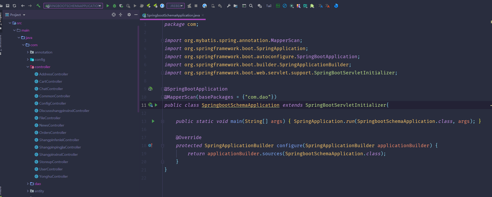

数据库表

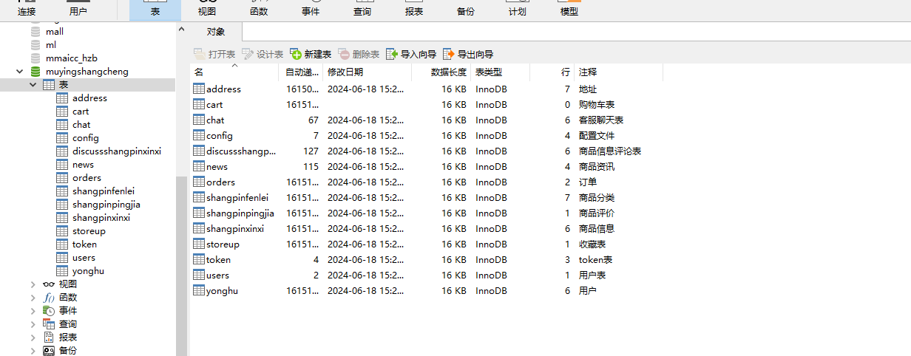

登录

用户管理

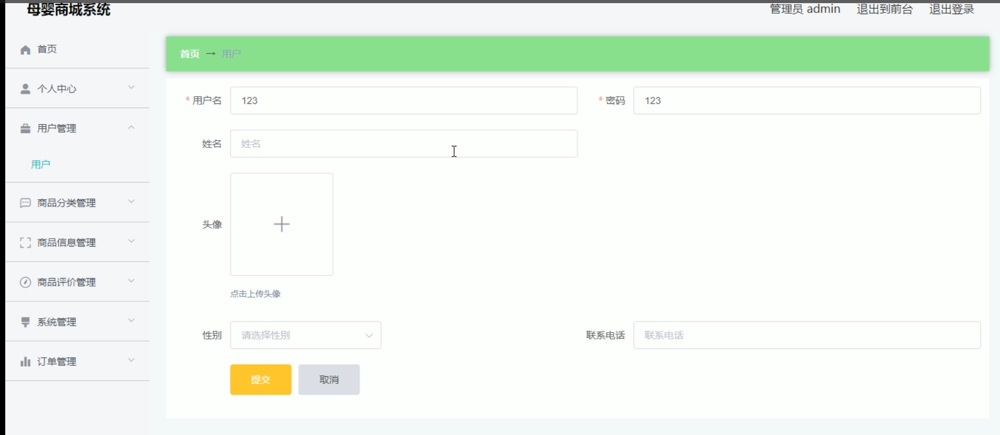

商品分类

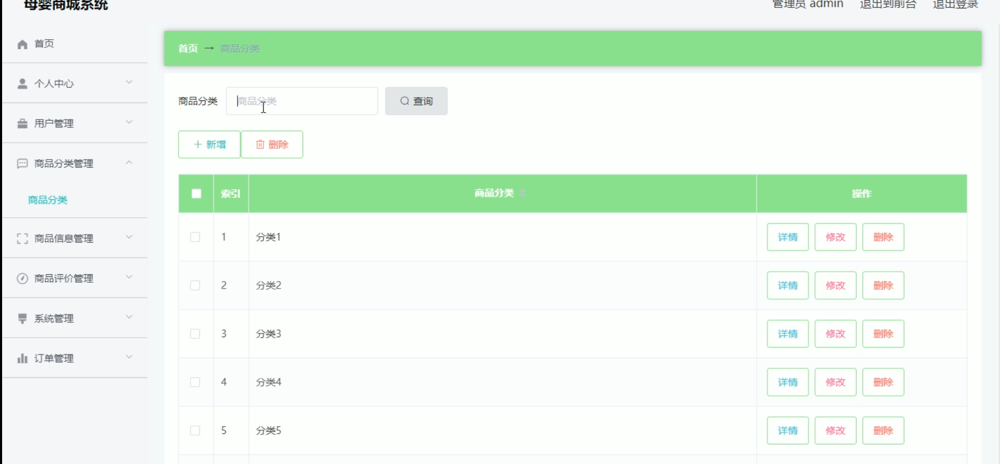

商品信息管理

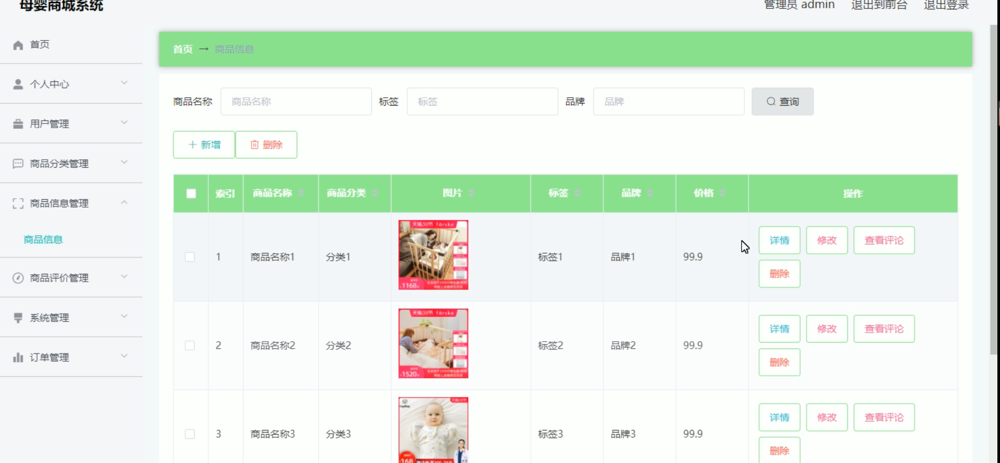

商品评价管理

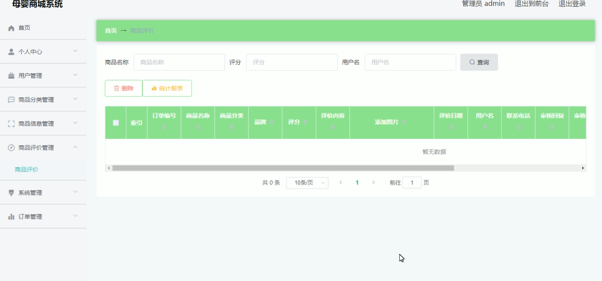

系统管理

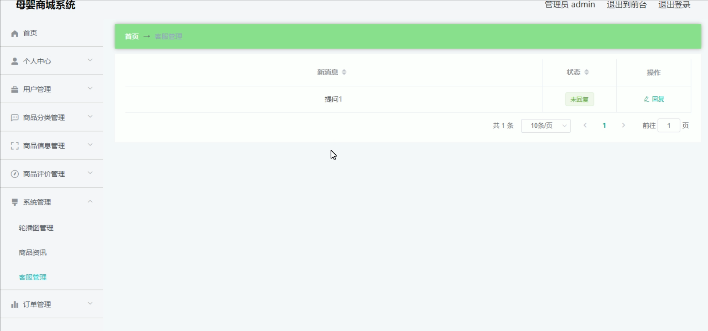

用户端首页

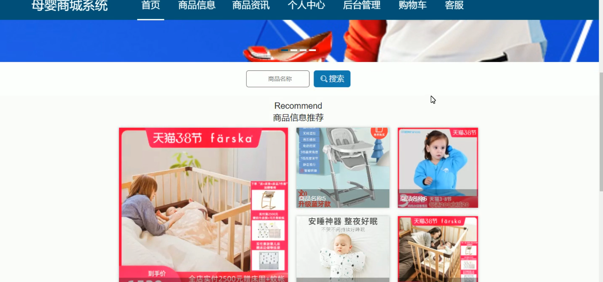

购物车

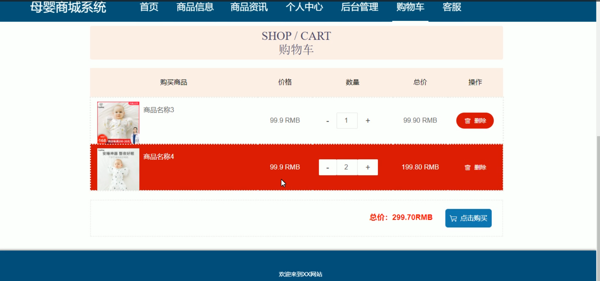

个人中心

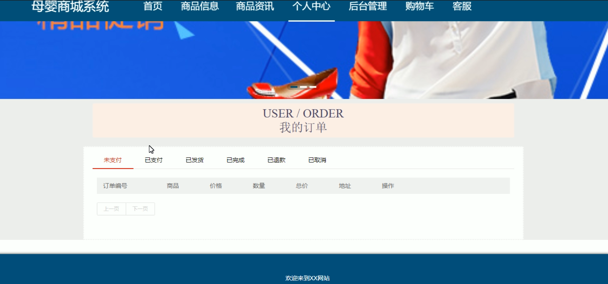

后台管理

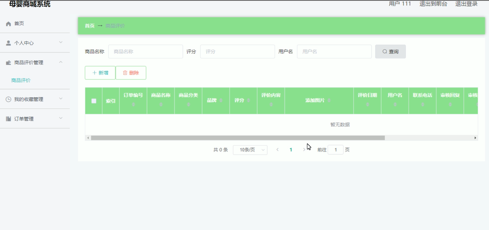

#### 总结

母婴商城系统通过分角色、分模块的设计，实现了管理端和用户端的全面功能覆盖。管理端高效的运营管理和精准的分类资讯发布，为平台的正常运作提供了保障；用户端便捷的购物体验和个性化的账户管理，满足了用户的多样化需求。通过完善的评价和客服管理，系统有效地提升了用户满意度和平台口碑。未来，本系统将继续优化和扩展功能，为用户提供更加优质的母婴产品购物体验。

#### 使用说明

创建数据库，执行数据库脚本 修改jdbc数据库连接参数 下载安装maven依赖jar 启动idea中的springboot项目

后台管理   ：http://localhost:8080/muyingshangcheng/admin/dist/index.html 

前台页面   ：http://localhost:8080/muyingshangcheng/front/pages/login/login.html  

管理员：admin

密码：admin     

